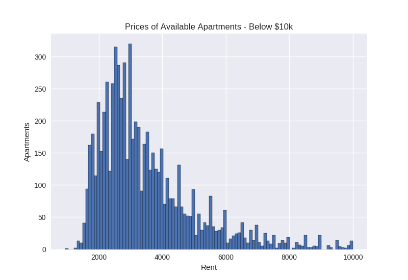
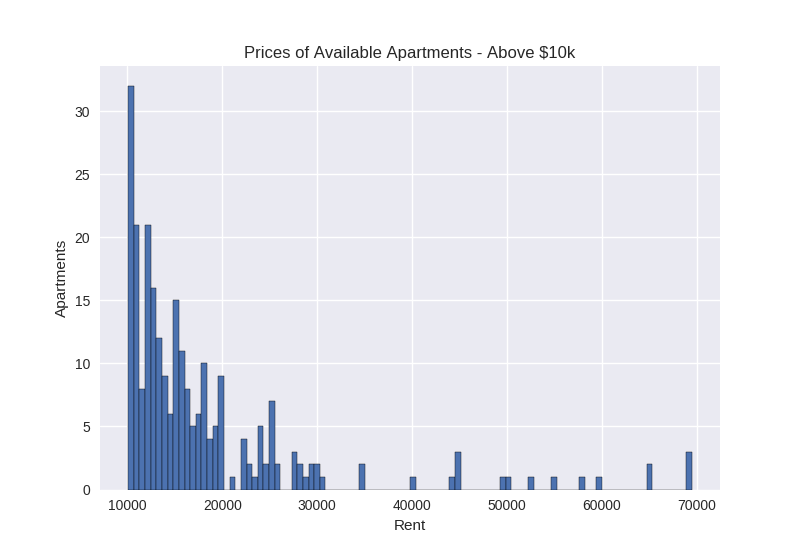
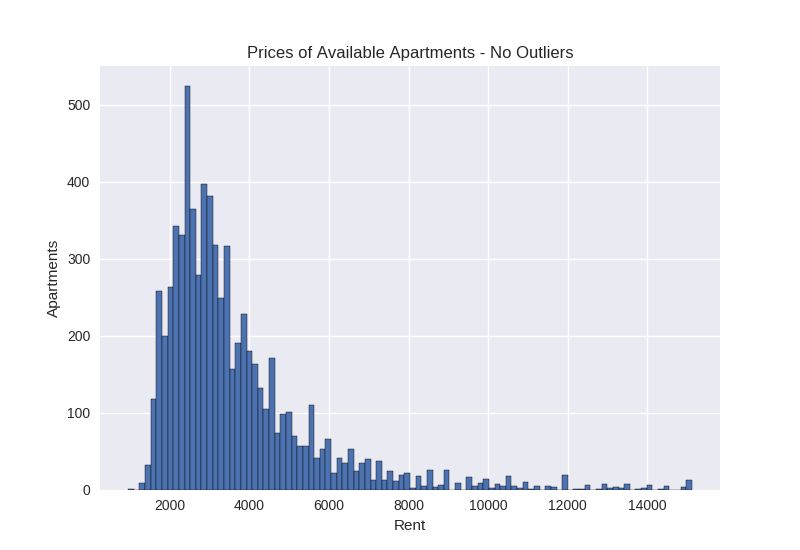

# RentCity
# Predicting NYC Rent Prices based on Apartment Features
### 
## Background
I recently had to find an apartment in NYC, which is a difficult process compared to most other cities.  High rents, broker fees, and being on the market for only days makes the process extremely difficult.  I decided it would be handy to know if an apartment is fairly priced by being able to predict the rent for an apartment based on features such as nighborhood, sqft, and amenities. 

## Data Collection
All data was scraped from <a href="https://streeteasy.com/for-rent/nyc">streeteasy.com</a>, widely considered the most robust apartment site for NYC. Data was collected June 28, 2019 thru June 30, 2019, on 7400 apartments.

Scraping proved to be extremely difficult for two reasons.  Firstly, the site does not allow headless requests, and it uses javascript.  Python's requests library can handle adding headers, however it can't handle JS pages because it doesnt wait for the JS to load before it collects the HTML.

Selenium proved to do the trick, allowing for the JS to load before completeing the get request.  However, a new problem appeared - CAPTCHA.  I am not a robot, however I wasn't able to figurew out a way around this, so for almost two days I had to reassure the site, and myself, that I am not a robot.

## EDA and Hygien
Total Apartments - 7408 
Average Rent - $4028 
Most Expensive Rent - $69500 
Least Expensive Rent - $950

  
  

    
    

  

    
    

 

I decided to remove outliers, since a 70k apartment should skew the data.  I ran a z-test on the price column and removed any apartments that scored more than a 3 on the z-test. Roughly 100 apartments were removed.  Below is the new histogram with no outliers.  

I then removed all unneeded and junk columns, and combined redundant columns.  For example, there was a cats column and a dogs column, I combined them to be a pets colum.  Similarly I combined multiple parking columns.

I then imputed missing sqft values by filling them with the mean of apartments in the same neighborhood and having the same number of bedrooms.

After looking at the data, I believe the price is most closely related to sqft and neighborhood.  The below scatter plot comparing sqft to price, and color coding by borough seems to support this belief. 

    
    

## Modeling
I started by using Lasso Regression to look for linear relationships.  I chose R2 as my error metric, and Lasso scored just  <b>.70</b> using the default alpha value.

I then decided to try Random Forest Regression, and scored much better right out of the gate, getting an R2 value of <b>.79</b> on the first run.  After adjusting N_estimators to 50, and max_depth to 8, I was able to manage a not great, but not terrible, R2 score of <b>.84</b>.  Random forest looks to be the better fit, probably because there are so many categorical amenities features (almost 200).

As you can see from plotting the residuals using random forest, my model worked much better on apartments priced below $5k.   

    
    

As hypothesized, sqft and location has the most effect on pric, however borough was more important than nieghborhood, which suprised me.  I think we'd need more samples to see if neighborhood has more effect on the price. 

    
    

## Take Aways
I did well creating plots, doing EDA, and hypothesizing the feature importances.  All of those stages went smoothly and as expected.  I'd also like to rework the model or try new ones to try to get better prediction results.  Also, scraping could be done much more efficiently if I can find a way to get around CAPTCHA.  I am not a robot, but my scraper is.

Most importantly, more work needs to be done on the code to make it more readable and efficient.

